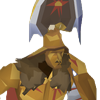

# sol_herebot



Sol Herebot is the champion of OSRS Discord Bots!

> [!IMPORTANT]
> This is very much a work in progress, and I'm only working on this in my free time.
> If you have any feature requests, feel free to open an issue.

## Commands

Here are all of the supported commands:

`/iam` - registers your discord user id with the given osrs name (to be used in other commands)

`/randomraid` - returns a random raid

`/price` - returns the current price for the item that best matches the provided name

## API integrations

This bot is only possible due to the generosity of the OSRS team and the OSRS wiki team.

## Tech stack

### Bun

This project was created with `bun` via `bun init` v1.1.29. See [Bun](https://bun.sh) for details.

To install dependencies:

```bash
bun install
```

To run:

```bash
bun run bot.ts
```

To upgrade Bun:

```bash
bun upgrade
```

