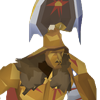

# sol_herebot



Sol Herebot is the champion of OSRS Discord Bots!

> [!IMPORTANT]
> This is very much a work in progress, and I'm only working on this in my free time.
> If you have any feature requests, feel free to open an issue.

## Requirements

- [Node.js](https://nodejs.org/) 22 or newer
- [pnpm](https://pnpm.io/) 12 (via [Corepack](https://nodejs.org/api/corepack.html): `corepack enable`)

## Commands

Here are all of the supported commands:

`/iam` - registers your discord user id with the given osrs name (to be used in other commands)

`/randomraid` - returns a random raid

`/price` - returns the current price for the item that best matches the provided name

`/how-lucky-am-i` - compares your boss collection log (from TempleOSRS) against osrs wiki drop rates, as a luck ratio and in hours. Takes an optional `username` (defaults to your `/iam` name) and an optional `boss` for a per-item breakdown

## API integrations

This bot is only possible due to the generosity of the OSRS team and the OSRS wiki team.

## Development

Install dependencies:

```bash
pnpm install
```

Register slash commands with Discord (requires `DISCORD_TOKEN` and `DISCORD_CLIENT_ID`):

```bash
pnpm commands
```

Run the bot:

```bash
pnpm start
```

Typecheck, lint, and format:

```bash
pnpm typecheck
pnpm lint
pnpm format
```

## Docker

Run the bot in the background so it stays up after you close the terminal.

Compose does not read `~/.zshrc`. It copies variables that are already exported in the terminal where you run `make`. `DISCORD_TOKEN` and `DISCORD_CLIENT_ID` need `export` in your shell. After you change them, run `make up` again so the container is recreated.

```bash
make up
make logs
make down
```

Register slash commands once from that same shell:

```bash
make commands
```
